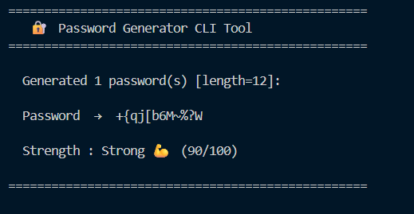

# 🔐 Password Generator CLI Tool

A modular command-line application for generating secure and customizable passwords using Python.

---

## 📁 Project Structure

```
password-generator-cli/
│
├── password_generator/
│   ├── __init__.py          # Package exports
│   ├── generator.py         # Core password generation logic
│   ├── strength.py          # Password strength analysis
│   └── utils.py             # File saving & clipboard utilities
│
├── tests/
│   └── test_generator.py    # Unit tests (pytest)
│
├── main.py                  # CLI entry point
├── requirements.txt
├── .gitignore
└── README.md
```

---

## 🚀 Getting Started

### 1. Clone the repository
```bash
git clone https://github.com/your-username/password-generator-cli.git
cd password-generator-cli
```

### 2. Create a virtual environment
```bash
python -m venv venv
source venv/bin/activate        # macOS/Linux
venv\Scripts\activate           # Windows
```

### 3. Install dependencies
```bash
pip install -r requirements.txt
```

---

## 💻 Usage

```bash
python main.py [options]
```

### Options

| Flag                   | Description                                      | Default |
|------------------------|--------------------------------------------------|---------|
| `-l N`, `--length N`   | Set password length                              | `12`    |
| `-c N`, `--count N`    | Number of passwords to generate                  | `1`     |
| `--no-uppercase`       | Exclude uppercase letters (A-Z)                  | Off     |
| `--no-lowercase`       | Exclude lowercase letters (a-z)                  | Off     |
| `--no-digits`          | Exclude digits (0-9)                             | Off     |
| `--no-symbols`         | Exclude special characters                       | Off     |
| `--exclude-ambiguous`  | Exclude confusing chars (0, O, l, 1, I)          | Off     |
| `--save`               | Append password(s) to `passwords.txt`            | Off     |
| `--copy`               | Copy first password to clipboard                 | Off     |
| `--check "PASSWORD"`   | Check the strength of a given password           | —       |

---

## 📌 Examples

```bash
# Generate a default 12-character password
python main.py

# Generate a 20-character password
python main.py -l 20

# Generate 5 passwords of length 16
python main.py -l 16 -c 5

# No symbols, no ambiguous chars
python main.py -l 14 --no-symbols --exclude-ambiguous

# Save to file
python main.py -l 18 --save

# Copy to clipboard
python main.py -l 16 --copy

# Check strength of an existing password
python main.py --check "MyP@ssw0rd123"
```

---

## 📸 Demo


---

## 🧪 Running Tests

```bash
python -m pytest tests/ -v
```

---

## 🛠 Tech Stack

- Python 3.10+
- `argparse` — CLI argument parsing
- `random` / `string` — Password generation
- `pyperclip` — Clipboard support
- `pytest` — Unit testing

---

---
## 🎯 Why I Built This

Built this project to strengthen Python fundamentals, CLI application development, modular programming, and software testing practices.

The goal was to create a clean, reusable, and customizable command-line utility while improving project organization and testing workflows.
---

## 📝 License

MIT License — free to use and modify.
